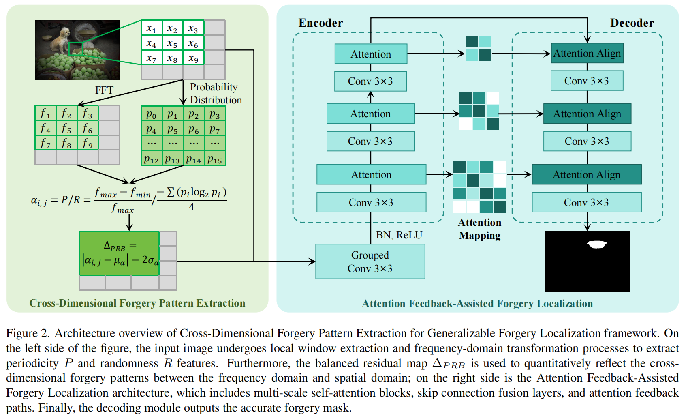
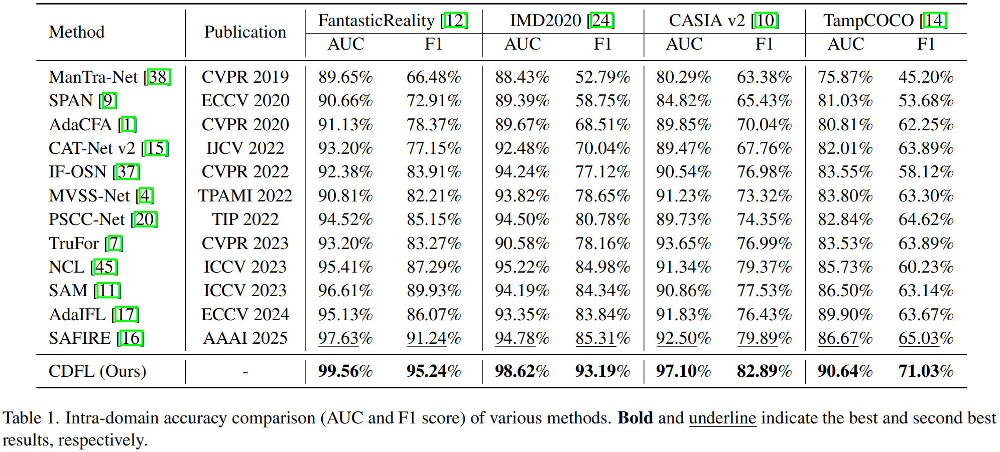
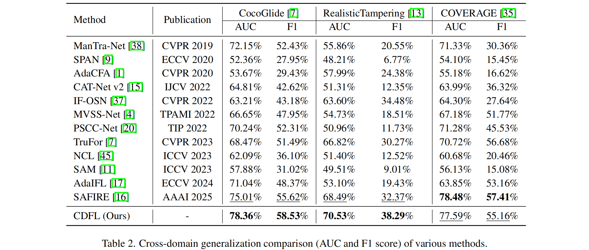

# Cross-Dimensional Forgery Pattern Extraction for Generalizable Forgery Localization Framework

Image forgery technologies are iterating rapidly, becoming increasingly sophisticated and posing severe challenges to forgery detection. Existing localization methods extract forgery features via supervision signals but rely on massive samples to learn diverse forgery patterns, leading to poor generalization to unseen forgery techniques. 

From the image space perspective, specific correlation patterns exist between pixels, with significant differences between real and forged images. Thus, this paper proposes the **C**ross-**D**imensional Forgery Pattern Extraction for Generalizable **F**orgery **L**ocalization Framework (**CDFL**), which extracts forgery traces from pixel correlation patterns to achieve high-precision, generalizable localization. CDFL amplifies real-forged pixel correlation differences in two dimensions: spatial and frequency domains. In the spatial domain, spatial randomness features are obtained via entropy calculation; in the frequency domain, frequency periodicity features are extracted through local window frequency filtering. Subsequently, a balanced residual map of the two features is constructed to accurately characterize forgery patterns in the cross-dimensional space, significantly improving generalization. Furthermore, Attention Map Assisted forgery localization is proposed to amplify unique correlation trajectories of forged regions between encoder-decoder skip connections, enhancing the feature response of forged regions. 

- The proposed CDFL framework extracts unified forgery traces via spatial and frequency-domain patterns, addressing the difficulty of covering cross-domain or novel forgery methods in localization.

- Spatial randomness and frequency periodicity features are extracted, with a balanced residual map constructed to characterize forgery patterns in the spatial-frequency cross-dimensional space.
- An Attention Map Assisted Forgery Localization architecture is established, leveraging encoder-decoder skip connections of pixel correlation attention maps to amplify unique forged region correlation trajectories for high-precision fine-grained localization.
- We conduct extensive comparative and generalization experiments, achieving state-of-the-art (SOTA) results on all datasets, with the F1 score improved by nearly 5% compared to existing advanced methods.

## Get Started

1. Install Python 3.10, PyTorch >= 2.8.
2. Train and evaluate. You can reproduce the experiment results on CASIA v2 dataset as `python main.py`.

## Main Result

**Intra-domain Accuracy Comparison.** Table 1 reports each method's localization performance in terms of F1 score and AUC. We observe that SDPAL achieves the highest performance on FantasticReality, IMD2020, and TampCOCO datasets.

**Cross-domain Generalization Comparison.** As shown in Table 2, on the COVERAGE test set, SDPAL achieved F1 and AUC scores second only to SAFIRE, a method proposed in 2025. This indicates that SDPAL demonstrates superior anti-interference capability and robustness compared to other methods when handling high-fidelity tampering scenarios.

